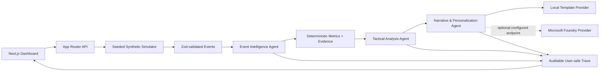

# Inside the Game — Explainable Match Intelligence

A mobile-first football intelligence dashboard that turns a seeded, entirely fictional match simulation into analyst and fan explanations with inspectable evidence. This is a hackathon prototype: it has no live match feed and makes no claim about real clubs, competitions, players, or results.

## What it demonstrates

- A deterministic, seeded fictional match between Northbridge FC and Harbor City, with 22 fictional players and a repeatable second-half scenario.
- Event generation, calculated possession/territory/pressure/shot-quality proxies, and bounded momentum.
- An observable three-stage workflow: Event Intelligence → Tactical Analysis → Narrative & Personalization.
- Schema-validated API contracts and structured narrative output; local deterministic templates work without Azure credentials.
- An evidence panel linking interpretations to event IDs, confidence, alternatives, and caveats.
- Analyst and fan views, favourite-team/player selection, adjustable simulation speed, reset, and a live event feed.
- Searchable event timeline with team/type/player filters, focused-player event counts, a single-player stats API, and downloadable synthetic CSV match reports.
- GitHub Actions CI for type, test, lint, and production-build checks.

## Architecture



The orchestration stages are explicit and run in order in `lib/agents.ts`. The deterministic local orchestrator is the default. Model output is constrained to a JSON Schema and validated again with Zod before it can be stored or shown. Only concise rationale, supporting evidence, and alternatives are exposed; hidden chain-of-thought is not requested or displayed.

## Local setup

Requirements: Node.js 20 or newer and npm.

```bash
npm install
cp .env.example .env.local
npm run dev
```

Open <http://localhost:3000>. The default app uses only local synthetic data and requires no credentials. Starting the simulation adds events and produces a traceable insight. Reset restores the same tied early-second-half scenario.

Useful commands:

```bash
npm run typecheck
npm run lint
npm test
npx playwright install chromium
npm run test:e2e
npm run build
```

## API

All API responses containing generated insights or traces use the matching Zod schema before being returned. Invalid request bodies return a typed `{ "error": { "code": "...", "message": "..." } }` response.

| Method | Route | Purpose |
| --- | --- | --- |
| `GET` | `/api/match` | Current match, events, metrics, insights, and traces |
| `POST` | `/api/match/reset` | Restore the repeatable demo state |
| `POST` | `/api/simulation/start` | Start and generate the first event/insight |
| `POST` | `/api/simulation/pause` | Pause event generation |
| `POST` | `/api/simulation/tick` | Generate one simulation event and update analysis |
| `GET` | `/api/events` | Current synthetic event list |
| `GET` | `/api/players/{playerId}` | Calculated synthetic event involvement counts for one fictional player |
| `GET` | `/api/insights` | Up to three priority insights |
| `POST` | `/api/insights/analyze` | Analyze an optional event-ID selection for a viewer |
| `GET` | `/api/traces` | User-safe agent traces |
| `GET` | `/api/health` | Health and active-provider mode (no secrets) |

The simulation state is held in process memory. This is appropriate for a single-instance demo, not a horizontally scaled or durable production service. The Container Apps sample therefore pins the app to one replica. A true public launch should add durable shared state, abuse/rate controls, monitoring, and a decision about whether anonymous users may trigger Foundry calls.

## Foundry setup

The Microsoft Foundry-compatible provider is opt-in. Copy `.env.example` to `.env.local` and configure:

```dotenv
FOUNDRY_ENDPOINT=https://YOUR-RESOURCE.openai.azure.com
FOUNDRY_DEPLOYMENT=YOUR-CHAT-DEPLOYMENT
FOUNDRY_API_KEY=YOUR-SECRET
FOUNDRY_API_VERSION=2024-10-21
```

Use the Azure OpenAI-compatible endpoint, deployment, and API version for your model deployment in Microsoft Foundry. The integration sends a bounded verified insight and selected fictional favourite to the chat-completions endpoint, requests a strict JSON Schema response, uses an eight-second timeout, and validates the returned narrative with Zod. On network, HTTP, or response-validation errors, it logs a safe diagnostic without credentials and falls back to the local template provider. Do not put credentials in source control or browser code.

The agent stages and tool-free local orchestrator do not depend on Microsoft Agent Framework. The implementation is intentionally runnable without cloud configuration or an SDK. The provider/orchestrator seams allow an Agent Framework adapter to be added when the target Foundry project and supported SDK version are selected; that optional SDK path has not been exercised by this prototype.

## Testing

- `tests/schemas.test.ts` covers schema validation and invalid confidence/event inputs.
- `tests/simulation.test.ts` covers seeded repeatability, generated event validation, 150+ event capability, and deterministic metrics.
- `tests/agents.test.ts` covers local provider selection, workflow evidence, and the trace shape.
- `tests/analytics.test.ts` covers player event statistics and synthetic CSV report generation.
- `e2e/dashboard.spec.ts` starts the app, starts the simulation, and verifies an insight and agent trace appear.

The Playwright config starts the development server automatically. The e2e smoke test requires a Playwright browser installation.

## Docker and Azure Container Apps

Build and run locally:

```bash
docker build -t inside-the-game .
docker run --rm -p 3000:3000 inside-the-game
```

For Azure Container Apps, build and push the image to Azure Container Registry, then deploy `infra/container-app.yaml` after replacing its environment and image placeholders. Create a Container Apps secret named `foundry-api-key` only if using Foundry, add a `FOUNDRY_API_KEY` container environment entry that references that secret, and set the Foundry endpoint/deployment in the environment configuration. Keep secrets in the platform secret store, not in the YAML or image.

Example command outline:

```bash
az acr build --registry YOUR_ACR --image inside-the-game:latest .
az containerapp create --resource-group YOUR_RESOURCE_GROUP \
  --name inside-the-game --yaml infra/container-app.yaml
```

The YAML is a deployment starting point; resource IDs, registry access, secrets, and environment names must be configured for the target Azure subscription. Container deployment was not verified as part of this prototype.

## Synthetic-data policy

- Every match, event, team, and player is generated locally from fictional data.
- No real league data, club/player names, logos, video, copyrighted imagery, external sports-data APIs, or live scores are used.
- Seeded events are repeatable. Event IDs use `evt_0001` style identifiers and the event schema requires `synthetic: true`.
- UI labels distinguish raw event facts, calculated proxies, and AI-generated interpretations.
- Possession is shown as an event-share proxy; momentum and shot-quality are illustrative deterministic proxies, not official statistics, expected goals, or predictions.
- An interpretation always includes confidence, event evidence, and a caveat; alternatives are shown when ambiguity is plausible.

## Demo script (under two minutes)

1. **0:00–0:15** — Show the tied score, fictional team labels, demo-mode badge, and synthetic-data label. Explain that the event sequence is generated and repeatable.
2. **0:15–0:35** — Choose Harbor City and a favourite player. Switch briefly between Analyst View and Fan View.
3. **0:35–0:55** — Start the simulation. Point out the high press, interception, and progressive-pass events arriving in the timeline.
4. **0:55–1:15** — Read the insight headline, confidence, event-ID evidence, and caveat. Show the pitch map and calculated event metrics.
5. **1:15–1:35** — Click an evidence event. Walk through Event Intelligence, Tactical Analysis, and Narrative/Personalization in the trace panel, noting that the trace contains rationale rather than hidden chain-of-thought.
6. **1:35–1:50** — Switch to Fan View and highlight the plain-language commentary and favourite-player section.
7. **1:50–2:00** — Let the synthetic sequence reach its scripted goal, then reset to show that the opening state is repeatable.

## Limitations and future work

- In-memory match state is lost on restart and is not shared across multiple instances.
- Foundry is optional and its endpoint/model compatibility depends on resource configuration; only local mode is guaranteed to work without credentials.
- This prototype uses deterministic event and metric rules, not calibrated football models. “Momentum”, territory, and shot-quality are demo proxies.
- The local workflow is an explicit orchestrator, not an execution of the Microsoft Agent Framework SDK. A production integration should pin and validate the selected SDK and model contracts.
- Future work could add persistence, richer deterministic event sampling, dedicated accessibility audits, and an Agent Framework adapter—without introducing real-world match data unless the synthetic-only policy is deliberately changed.
